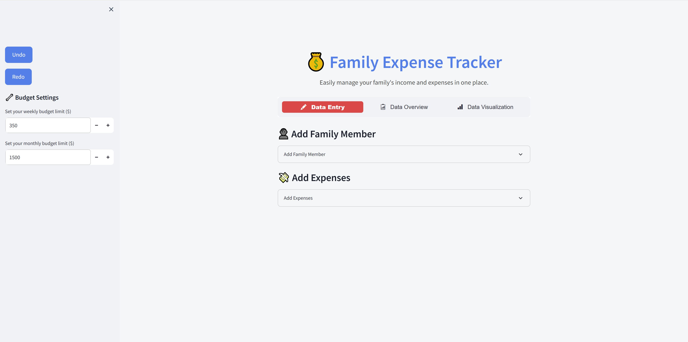
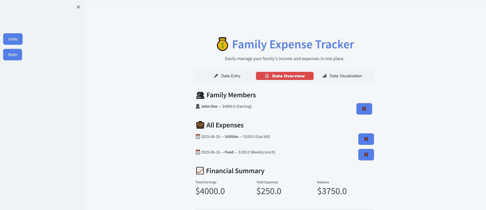
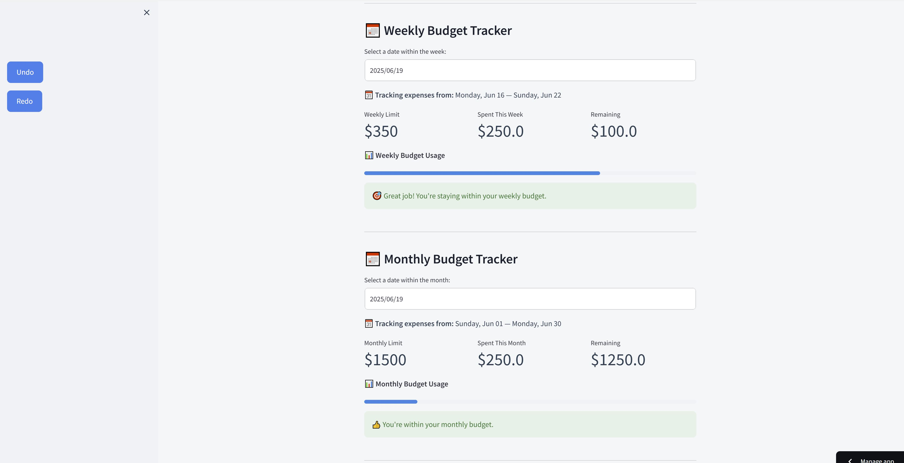
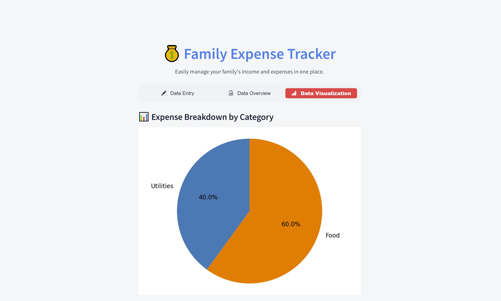

# Family Expense Tracker App

[Live Application](https://family-expense-tracker.streamlit.app)

---

## Overview

The Family Expense Tracker is a user-friendly budgeting and expense management web application built with Python and Streamlit. Designed to help families easily track income and expenses. This app provides insights into spending habits over customizable weekly and monthly periods. It includes features such as budget setting, data visualization, undo/redo actions, and priority expense tracking using efficient algorithms and data structures.

---

## Features

- **Add and manage family members:** Track earnings and status for each member.
- **Expense tracking:** Log expenses with categories, descriptions, values, and dates.
- **Dynamic filtering:** Filter expenses by date range, category, and amount.
- **Sorting:** Sort expenses by date, amount, or category in ascending or descending order.
- **Weekly and monthly budget setting:** Users can set personalized budget limits and monitor their spending.
- **Budget progress visualization:** Visual progress bars display how close users are to reaching their budgets.
- **Top expenses tracking:** Uses a max-heap data structure to efficiently display the largest expenses.
- **Undo/Redo functionality:** Stack based undo and redo of member and expense additions or deletions.
- **Data visualization:** Pie and bar charts for clear visual insights into spending.
- **CSV export:** Download expense data for offline use and further analysis.
- **Deployment-ready:** Containerized with Docker and hosted on Streamlit Community Cloud for easy access.

---

## Database Integration

- **Persistent Data Storage:** Replaced temporary in-memory storage with a SQLite database to save family members and expenses persistently.
- **Robust CRUD Operations:** Implemented secure and efficient Create, Read, Update, and Delete database operations for all data entities.
- **Improved Data Consistency:** Managed data integrity with foreign key constraints and safe query practices.
- **Enhanced Performance:** Optimized queries and data structures to handle larger datasets efficiently.
- **Seamless UI Sync:** Updated user interface components to dynamically fetch and display current data from the database.

---

## Application Screens

- **Main Application Screen:** On this screen, users can add family members and log their expenses.
  

- **Data Overview Screen:** On this screen, users can see a summary of family members, view all expenses, check their financial summary, and track their weekly and monthly budgets. They can also filter expenses, view their top expenses, and get motivational badges based on their budgeting performance.
  
  
  
  
- **Data Visualization Screen:** On this screen, users can explore their spending through colorful pie charts and bar graphs for better insight.
  
---

## Installation

1. **Clone the repository:**

    ```bash
    git clone https://github.com/mohammedkhan2024/CS499.git
    cd CS499
    ```

2. **Initialize the database:**

    ```bash
    python -c "import db; db.init_db()"
    ```

3. **Install dependencies:**

    ```bash
    pip install -r requirements.txt
    ```

4. **Run the app:**

    ```bash
    streamlit run app.py
    ```

---

## Usage

- Add family members and expenses through the intuitive UI.
- Set weekly and monthly budgets to monitor spending.
- Use filters and sorting to analyze your expenses.
- View detailed charts and download your data as CSV.

---

## License

MIT License

---
